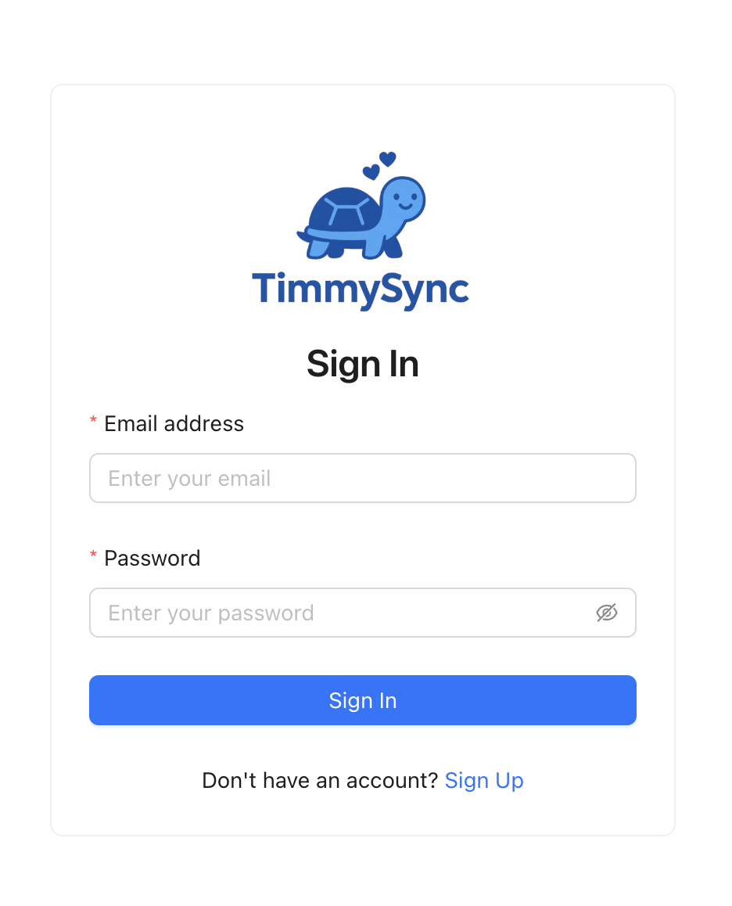
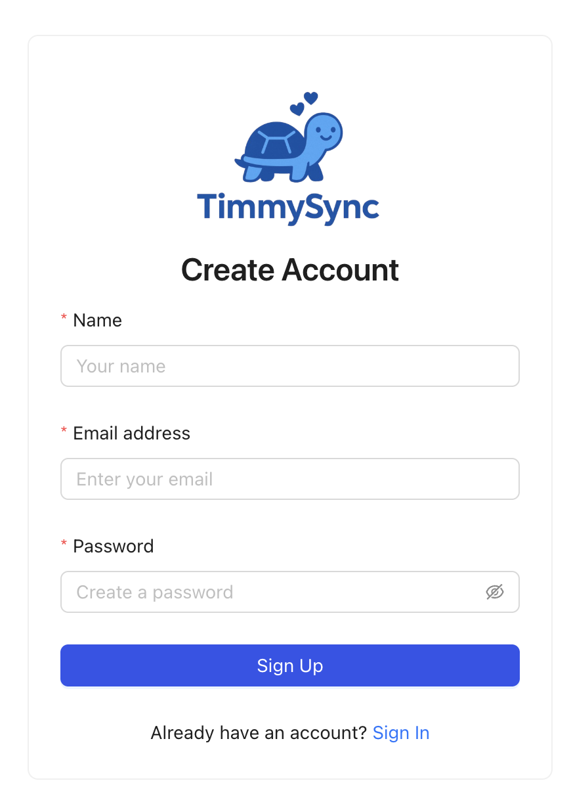
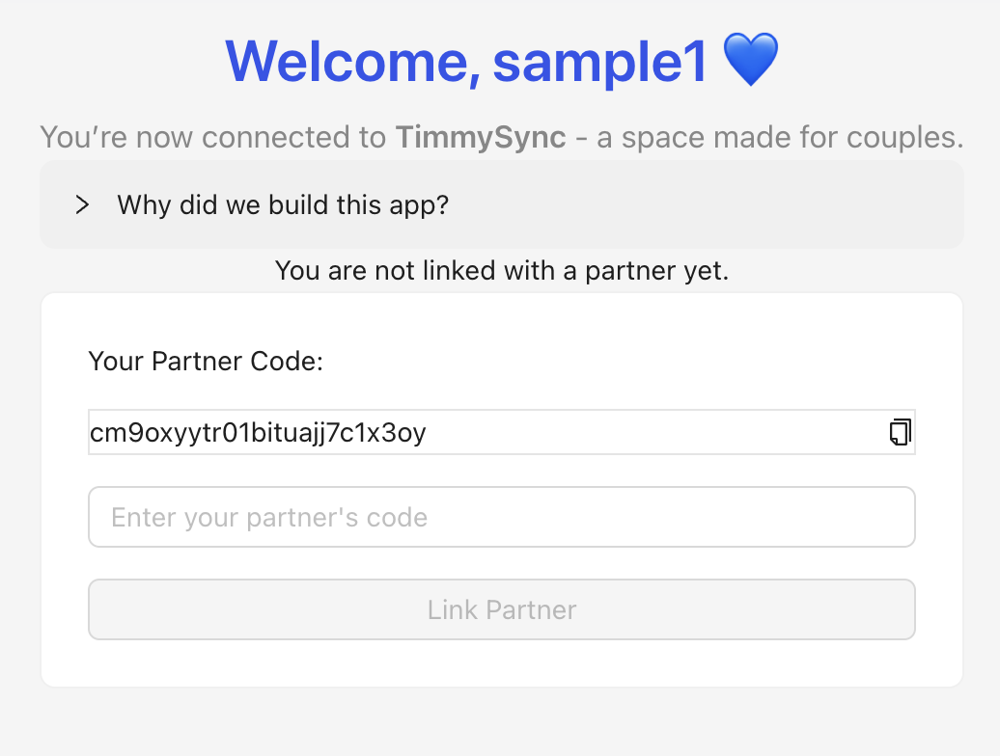
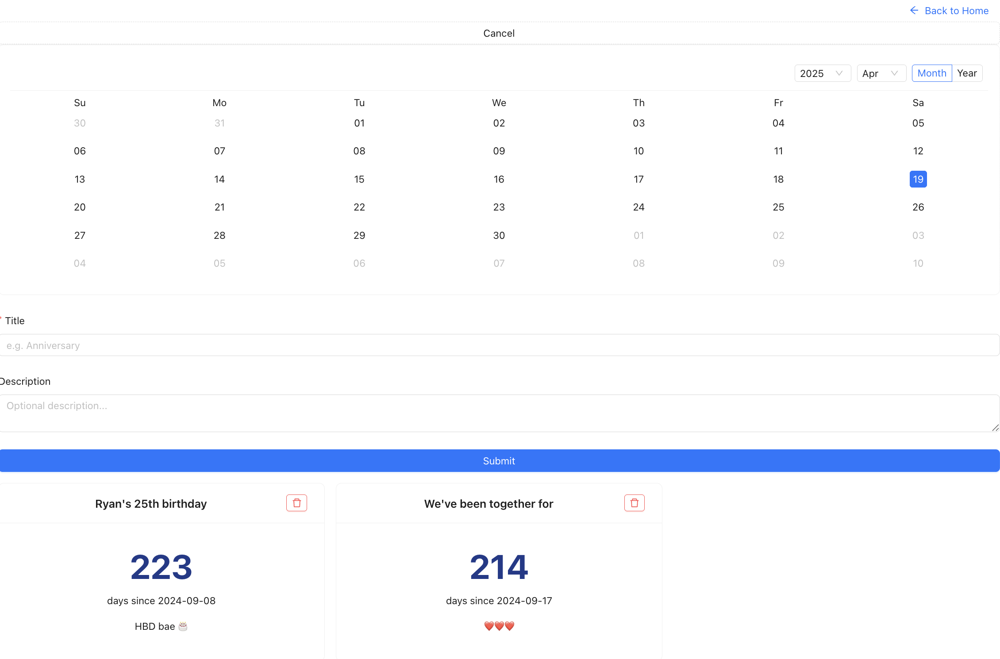
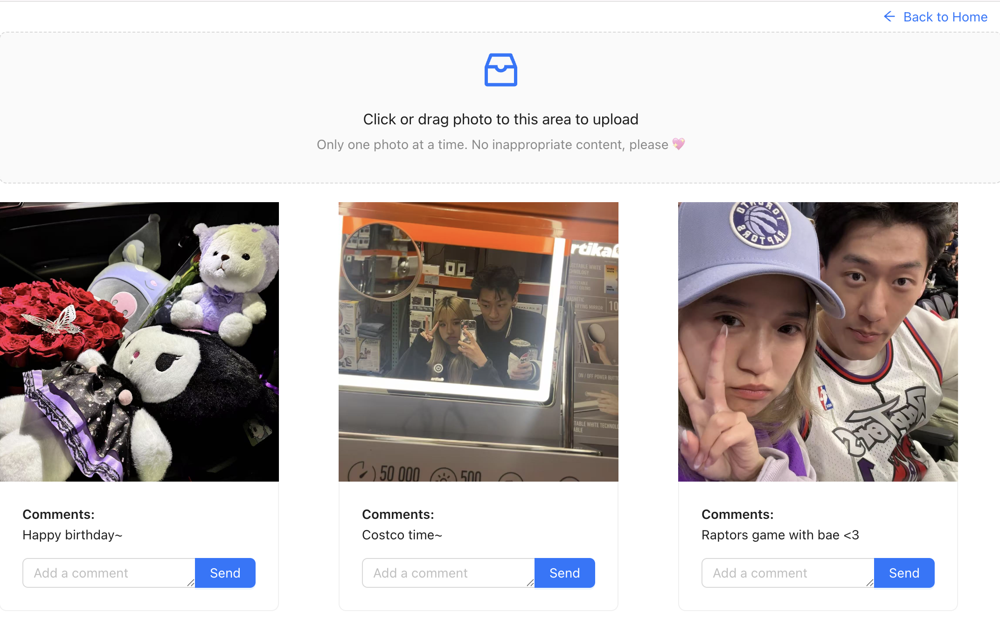
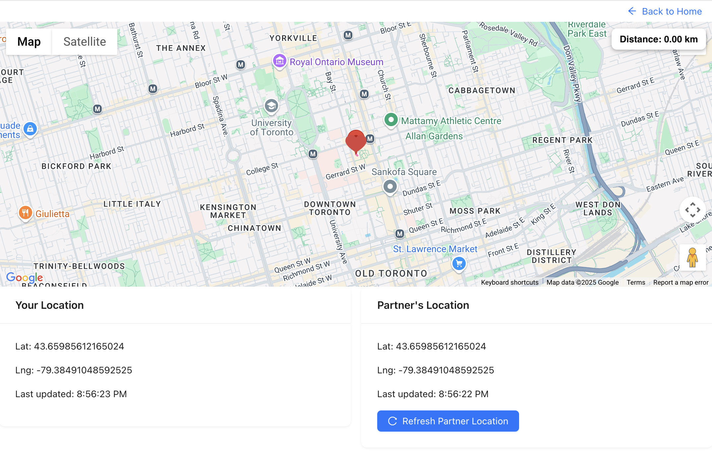

# TimmySync – A Relationship Enhancement Web Application


## Motivation

Maintaining meaningful communication in a relationship can be challenging, especially during busy periods or long-distance situations. We wanted to create an application that helps couples stay emotionally connected by offering shared tools for daily interaction, memory sharing, and real-time location awareness.

Our motivation stemmed from real-life needs. We noticed how many couples, including ourselves, could benefit from an easy-to-use tool that centralizes important shared moments, provides location awareness, and lets them leave spontaneous messages or photos in a shared space.

---

## Objectives

The main objectives of the project were:

- To create a real-time, partner-connected application where users can:
  - Track and view important shared dates (anniversaries, birthdays, etc.).
  - Upload, preview, and comment on shared photos.
  - Share live location with each other.
- Ensure the app is intuitive, aesthetically pleasing, and functionally responsive.
- Support authentication, user linking, and mutual partner pairing logic.

---

## Technical Stack

- **Framework**: Next.js 13+ (App Router with server and client components)
- **Frontend Libraries**:
  - Ant Design (UI Components)
  - Tailwind CSS (Custom styling)
  - Shadcn/UI (Supplemental UI styling)
- **Backend**:
  - Next.js server-side route handlers (API routes)
  - Supabase (for PostgreSQL database + storage)
- **Database**:
  - Supabase PostgreSQL with Prisma ORM
- **Cloud Storage**:
  - Supabase Storage for hosting uploaded images
- **Authentication**:
  - NextAuth.js with email/password credentials
- **Real-time features**:
  - Supabase Realtime (for live location updates and comments)

---

## Features

### 1. User Authentication

- Sign up, sign in, and sign out functionality.
- Email and password-based credentials using NextAuth.
- Redirection based on session status.
    <!-- 
     -->
    <p align="center">
    
    &nbsp;
    
  </p>

### 2. Partner Linking System

- Each user is assigned a unique partner code.
- A user can input a code to link with their partner.
- Mutual relationship setup using self-referencing relation in the database.
  

### 3. Important Dates Tracker

- Users can create events like anniversaries, birthdays, or custom milestones.
- Dates are categorized and rendered in a readable format.
- Each user sees events created by either themselves or their partner.
  

### 4. Shared Photo Album

- Upload images with drag-and-drop UI.
- Display photos in uniform-sized cards with a zoom preview feature.
- Commenting system on each photo.
- Real-time comment updates using Supabase Realtime.
  

### 5. Real-Time Location Sharing

- Geolocation is captured from the browser and updated every few seconds.
- Partner's location is fetched both via polling and Supabase real-time events.
- Google Maps API displays both users' markers, along with a line indicating the distance.
  

---

## User Guide

### Sign Up / Sign In

- Users start by creating an account or signing in via email/password.

### Linking Partners

- Once signed in, a user is shown their partner code.
- Inputting a valid partner code links two users.
- Once linked, users gain access to shared features.

### Using Features

#### Important Dates

- Navigate to the "Important Dates" section.
- Add a new date using the form, specifying title, date, and description.
- Dates are saved and displayed in an ordered card format.

#### Shared Photo Album

- Navigate to "Shared Photo Album".
- Drag and drop to upload an image.
- Click a photo to view it full size.
- Scroll below to view and post comments.

#### Real-Time Location

- Navigate to "Real-Time Location".
- The map shows both users' current positions.
- Locations update automatically in real time.
- Distance is shown visually as a line between the markers.

---

## Development Guide

### 1. Environment Setup

#### Prerequisites

- Node.js 18+
- PostgreSQL-compatible database (using Supabase)
- Google Maps JavaScript API Key

#### Clone the repository

```bash
git clone https://github.com/qinshirl/ece1724_webdev_project.git
cd ece1724_webdev_project
```

### Install Dependencies

```bash
npm install
```

---

### Environment Variables

Create a `.env.local` file in the root of your project with the following content:

```env
# PostgreSQL database connection
DATABASE_URL=postgresql://<username>:<password>@<host>:<port>/<database>

# NextAuth authentication
NEXTAUTH_SECRET=your_nextauth_secret
NEXTAUTH_URL=http://localhost:3000

# Supabase
SUPABASE_URL=https://yourproject.supabase.co
SUPABASE_ANON_KEY=your_supabase_anon_key
SUPABASE_BUCKET=your_bucket_name

# Google Maps
GOOGLE_MAPS_API_KEY=your_google_maps_api_key
```

> **Note:** Never commit the `.env.local` file to version control. Use `.env.example` for structure reference.

---

### Database Initialization

Run the following commands to generate and push the schema to Supabase/PostgreSQL:

```bash
npx prisma generate
npx prisma db push
```

---

### Cloud Storage Configuration

We used [Supabase Storage](https://supabase.com/storage) for hosting uploaded photos.

To configure:

1. Go to your Supabase project.
2. Navigate to **Storage > Buckets**.
3. Create a private bucket (e.g., `photo-album`) and use this bucket name in `.env.local` as `SUPABASE_BUCKET`.

Also make sure Row Level Security (RLS) is disabled for this bucket if needed.

---

### Local Development and Testing

To run the development server locally:

```bash
npm run dev
```

Access the app at:

```
http://localhost:3000
```

Ensure Supabase and PostgreSQL URLs in your `.env.local` file point to your hosted services or local mock services.

---

## Concluding Remarks

This project allowed us to go beyond basic CRUD functionality and integrate real-time and cloud storage features using full-stack Next.js. Some of the most valuable technical and soft skills we developed include:

- Working with **Supabase Realtime** and storage in a production-like context.
- Using **NextAuth.js** for secure authentication with session handling.
- Combining **Ant Design** with **Tailwind CSS** for elegant and responsive UI.
- Structuring a modular **Next.js App Router** layout across several pages and APIs.
- Learning to debug complex state and broadcast interactions in real-time systems.
- Collaborating efficiently through GitHub and dividing responsibilities while keeping consistency.

We’re proud that this app reflects a personal use case and provides a real tool for improving daily communication and closeness between partners. We believe **TimmySync** could be extended further in the future with mobile responsiveness, notifications, and user customization.

---

## Video Demo

**Video URL:**
https://drive.google.com/file/d/1chhJV58txvTedm4AqwEKWlxXVadODBPt/view?usp=sharing

---

## License

This project is for academic use only. All rights reserved to the project team (Shirley Qin & Yuyang Zeng).
